# Voice Assistant Review Sentiment Classifier

**Live demo:** https://smalik25-voice-assistant-review-sentiment-classifier.hf.space (paste a
review and get a prediction; `/docs` for the API).

I predict a binary sentiment label for Amazon Alexa reviews from their text, and I built the
whole lifecycle around it: curating and validating the data, a config-driven harness that
runs cross-validated experiments across scikit-learn, PyTorch, and TensorFlow, a
containerized inference service, and a drift monitor. The models are almost the least
interesting part. The point is the harness, the honest metrics, and being clear about what
the label actually is.

## The short version

The `feedback` label is not human sentiment. It is a hard threshold on the star `rating`:
1 and 2 stars are negative, 3 through 5 are positive, with no exceptions in the data. So the
real task is recovering that threshold from free text, and the interesting rows are the ones
where the text and the stars disagree.

The data is small (about 3,150 reviews, roughly 250 negative) and about 92% positive, so
accuracy is a trap. A model that predicts "positive" for everything already scores in the
low nineties. I report everything against that majority baseline, negative class first.

The finding I care about: once I selected models properly (on PR-AUC, not raw recall), the
regularized linear model ranked negatives as well as or better than the deep learning
variants. The PyTorch and TensorFlow MLPs came out within a few thousandths of each other
and a notch below the linear control. On this data, the extra complexity did not earn its
place. That is the result, not a disappointment.

## Lifecycle

```mermaid
flowchart LR
    raw[amazon_alexa.tsv] --> curate[curate + Pandera validate]
    curate --> curated[(curated.parquet)]
    curated --> harness[config-driven harness]
    subgraph variants[variants, one config each]
        skl[sklearn control]
        pt[PyTorch MLP]
        tf[TensorFlow MLP]
    end
    harness --> variants
    variants --> mlflow[(MLflow runs)]
    mlflow --> ablation[ablation table + selection]
    ablation --> export[export selected model]
    export --> bundle[(model.joblib)]
    bundle --> api[FastAPI /predict]
    bundle --> monitor[drift check PSI/KS]
    api --> docker[Docker image]
```



### Data curation and validation

`src/data` loads the raw TSV, drops the 80 rows with no usable review text, and drops 686
exact duplicate records so identical rows cannot land in different cross-validation folds
and leak. That leaves 2,384 reviews, 205 of them negative. A Pandera schema
(`src/data/schema.py`) enforces the column types, non-empty text, a binary label, and the
label rule itself, so if a future data refresh ever broke `feedback == 1 iff rating >= 3`,
validation would fail loudly instead of letting a silent change through. `data/README.md`
is the data card.

### The harness

Every experiment is a config file. `src/run_experiment.py` reads it, seeds Python and numpy
from it, runs the named variant, and logs params, metrics, and the model to MLflow. Nothing
is hardcoded and nothing is hand-copied. The ablation table
(`src/evaluation/ablation.py`) is generated from the logged runs. Shared preprocessing
(`src/features`) and a single evaluation function plus a repeated stratified k-fold protocol
(`src/evaluation`) mean every variant is scored the same way on the same folds, so the
comparison is fair.

### The ablation and the honest metric story

The variants are the sklearn control (logistic regression on TF-IDF, L1 vs L2 on a `C`
grid), a PyTorch MLP on TF-IDF, and a TensorFlow MLP that mirrors it exactly. The MLPs are
sklearn-compatible estimators, so they run through the same folds and evaluation as the
control.

The most useful mistake in the project: I first selected the control on cross-validated
negative recall, and it collapsed into a degenerate model that predicted "negative" for
almost everything (recall 0.95, precision 0.15, the worst PR-AUC of any real model).
Switching selection to PR-AUC, which is threshold-independent, fixed it and moved the linear
model back to the top. Selection and the decision threshold are two separate choices, and
conflating them is what caused the problem.

Held-out results, negative class, ranked by PR-AUC:

| model | PR-AUC | neg recall @0.5 | neg precision @0.5 | specificity |
|---|---|---|---|---|
| sklearn logreg (L2) | 0.575 | 0.244 | 0.714 | 0.991 |
| PyTorch MLP | 0.526 | 0.415 | 0.500 | 0.961 |
| TensorFlow MLP | 0.523 | 0.390 | 0.500 | 0.963 |
| majority baseline | 0.086 | 0.000 | 0.000 | 1.000 |

### The chosen model and its operating point

The default 0.5 threshold is far too conservative here, so I pick the operating point
separately. I choose the threshold on out-of-fold training predictions (never the test set)
to reach negative recall of 0.80, then apply it to the held-out test. On unseen data that
lands at recall 0.76, precision 0.37, specificity 0.88. The trade is explicit: catching
about three quarters of negative reviews means most negative flags are false alarms and
about 12% of positive reviews get wrongly flagged. Whether that is worth it depends on what
a missed complaint costs versus a false one.

The L1 coefficients make the model legible. Negation and complaint words drive the negative
class (not, didn, poor, return, stopped, useless), and an L1 model is 85% sparse (267
nonzero words instead of 1,839), which is a much shorter explanation for the same ranking.
The report notebook (`notebooks/report.ipynb`) walks through all of this with figures.

### Serving

`src/serving` exports the selected model to a self-contained bundle (a plain scikit-learn
pipeline plus the operating threshold) and serves it with FastAPI. `/predict` takes review
text and returns the label, the negative probability, and the threshold applied. The
Dockerfile installs only `requirements-serve.txt`, so the image stays small and carries none
of the training or deep-learning stack.

### Monitoring

`src/monitoring` is designed-and-implemented drift monitoring, not live production
monitoring, because there is no real traffic here. It compares a batch against the training
reference on three signals (the model's negative-score distribution, review length, and
out-of-vocabulary rate) using PSI as the trigger and a KS test as a second opinion. It runs
as a scheduled check that exits non-zero on drift. `src/monitoring/README.md` is the design
doc, including the retraining trigger.

## Running it

```bash
python -m venv .venv && source .venv/bin/activate
pip install -r requirements-dev.txt      # full stack; the container uses requirements-serve.txt

# put amazon_alexa.tsv at data/raw/ (see data/README.md), then:
python -m src.data.build_curated                                  # curated + validated data
python -m src.run_experiment --config configs/sklearn_logreg_tfidf.yaml
python -m src.run_experiment --config configs/pytorch_mlp_tfidf.yaml
python -m src.run_experiment --config configs/tensorflow_mlp_tfidf.yaml
python -m src.evaluation.ablation                                 # the table above, from MLflow

python -m src.serving.export_model                                # models/model.joblib
docker build -t alexa-sentiment . && docker run -p 8000:8000 alexa-sentiment
```

Tests and lint: `pytest -q` and `ruff check src/ tests/`. CI runs both plus a smoke
experiment and a Docker build; the full deep-learning runs stay local by design.

## What I learned

The label was the whole project. Once I saw that `feedback` was just a thresholded star
rating, the right questions followed: what does accuracy hide, which cases actually need a
text model, and where does the model disagree with the stars in a way that might be more
right than the label. The modeling lesson was smaller and more useful than "try a bigger
model": the metric you select on decides what you get, and on a small imbalanced dataset a
regularized linear model is hard to beat. The deep learning variants earned their keep only
as evidence that the harness is framework-agnostic and the finding holds across backends.
